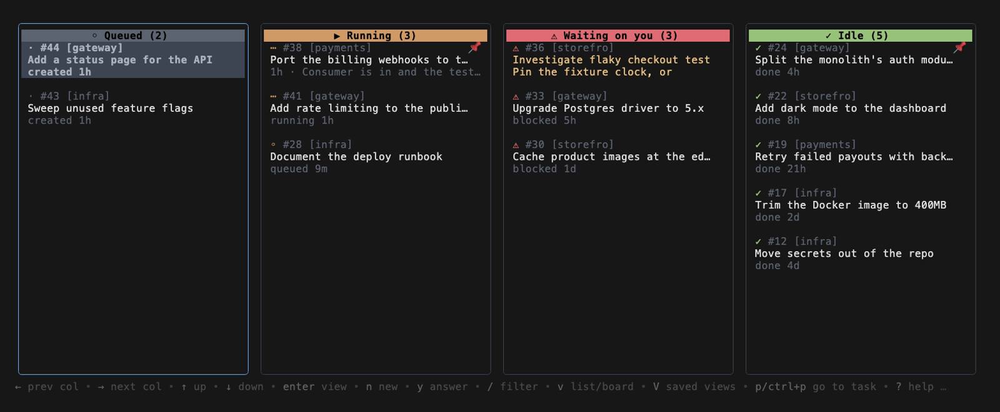
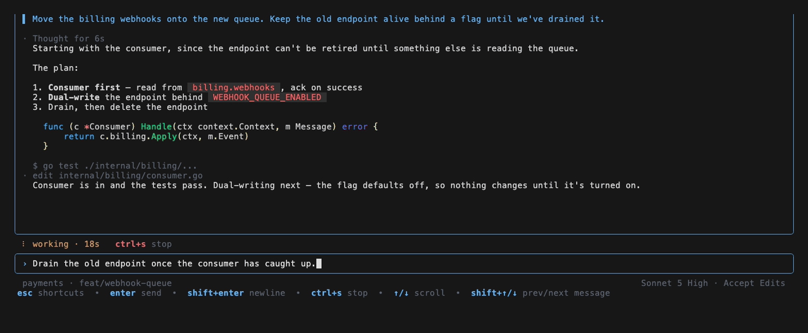
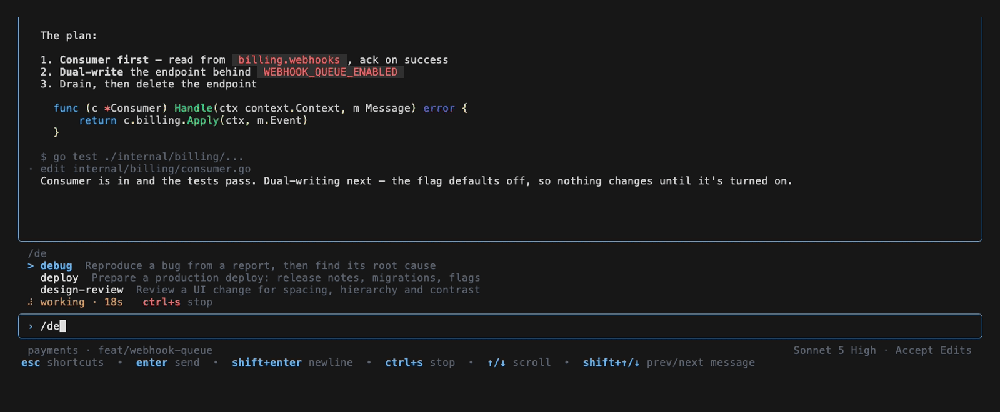

# bb-tui

A terminal UI for [bb](https://github.com/get-bb/bb), ported from the TaskYou TUI.

The board, thread view, composer, filters, saved views and command palette are
TaskYou's, running against bb: threads instead of tasks, read from bb's API
instead of from a local database.

Threads are grouped by what they are doing, and a thread reads as a
conversation — replies rendered as markdown, tool calls collapsed to a line
each, with a composer underneath.

`/` offers the project's skills and `@` its files, both from bb.

## Install

With Go:

    go install github.com/bborn/bb-tui/cmd/bb-tui@latest

With Homebrew, once a release is tagged:

    brew install bborn/tap/bb-tui

Or take a binary from the [releases page](https://github.com/bborn/bb-tui/releases)
— macOS and Linux, arm64 and amd64.

From source:

    git clone https://github.com/bborn/bb-tui && cd bb-tui
    go build -o bin/bb-tui ./cmd/bb-tui

## Run

    bb-tui

bb has to be running. bb-tui finds its server through `BB_SERVER_URL`, then
`~/.bb/bb-app-runtime.json`, then `http://127.0.0.1:38886`. TUI-local state — themes, saved views,
keybindings — lives in `~/.bb-tui/`; everything about threads comes from bb and
is never written locally.

## Keys

| key | does |
| --- | --- |
| `←` `→` | change column |
| `↑` `↓` | move within a column, or scroll a thread |
| `B` `P` `L` `D` | jump to Queued / Running / Waiting on you / Idle |
| `enter` | open a thread |
| `i` | write a message |
| `shift+↑` `shift+↓` | previous/next message |
| `ctrl+↑` `ctrl+↓` | previous/next thread |
| `ctrl+l` | jump to the latest message |
| `ctrl+g` | quote the message being read into the composer |
| `ctrl+t` | mouse capture on/off, for select and copy |
| `y` | answer an approval or question |
| `r` | retry a failed turn |
| `n` | new thread |
| `/` | filter; `V` saved views; `ctrl+p` palette |

In the composer: `enter` sends, `shift+enter` is a newline, `/` offers skills,
`@` offers files, `ctrl+o` picks the model, `ctrl+y` the permission mode,
`ctrl+v` attaches an image from the clipboard.

## Screenshots

`scripts/screenshots.sh` regenerates them with
[VHS](https://github.com/charmbracelet/vhs) from an invented workspace
(`internal/bbstore/demo.go`), so the images contain nobody's threads and need no
bb server. `bb-tui --demo` opens that workspace directly.

## Checking it without a terminal

    bin/bb-tui --debug-state --keys "enter,shift+up" [--view]

Drives the real model headlessly and prints the view tree as JSON, or the
rendered frame with `--view`.
